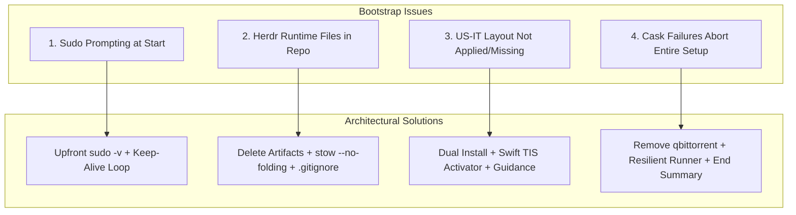

# Dotfiles Bootstrap, Stow Folding, Keyboard Layout, and Brew Resilience

> **Topic:** Fix fresh install issues on macOS (Homebrew sudo prompting, Herdr stow directory folding artifacts, keyboard layout activation, and resilient package installation).

---

## 1. Executive Summary & Problem Diagnosis

Following a fresh macOS format and running `./bootstrap.sh`, four issues were identified:



1. **Sudo Prompting at Startup**: `bootstrap.sh` executes Homebrew installation with `NONINTERACTIVE=1` without first prompting for administrator credentials. Because `NONINTERACTIVE=1` causes Homebrew to use `sudo -n`, installation aborts unless `sudo -v` was manually executed in terminal beforehand.
2. **Herdr Runtime Artifacts in Dotfiles**: In `justfile`, `stow` runs without `--no-folding`. When the destination directory `~/.config/herdr` does not exist, GNU Stow links the entire directory `~/.config/herdr -> .../.dotfiles/stow/herdr/.config/herdr`. When Herdr runs, its runtime files (`session.json`, `herdr-server.log`, `*.sock`, `.plugins.lock`) are created inside the git repository.
3. **Custom Keyboard Layout (`US-IT`)**: `scripts/setup-keyboard.sh` only copied `US-IT.bundle` to `~/Library/Keyboard Layouts/`. macOS caches keyboard layouts and does not index newly added bundles until a logout or restart. Furthermore, custom third-party layouts are placed in the "Others" category in System Settings, and no programmatic activation was performed.
4. **Deprecated Casks & Pipeline Resilience**: `cask "qbittorrent"` was disabled upstream in Homebrew on 2026-09-01 (failing Gatekeeper). When any package fails, `brew bundle` exits non-zero, causing `set -e` in `justfile` and `bootstrap.sh` to abort immediately and skip all subsequent setup steps (`runtimes`, `macos`, `touchid`, Raycast). Any errors should be captured and summarized at the end while allowing setup to proceed.

---

## 2. Interactive Design Decisions

> [!QUESTION]
> ### 1. Homebrew Sudo Authentication
> How should Homebrew handle administrative privileges at the start of `./bootstrap.sh`?
> - [x] **(Recommended) Prompt Upfront & Maintain Keep-Alive**: Run `sudo -v` at script start and spawn a background keep-alive loop so credentials remain active for Homebrew, Touch ID setup, and system layouts.
> - [ ] **Interactive Homebrew Execution**: Remove `NONINTERACTIVE=1` from Homebrew installer call and enter credentials on prompt midway through.

> [!QUESTION]
> ### 2. Herdr Runtime Artifacts in Dotfiles
> How should we eliminate and prevent runtime artifacts from polluting `.dotfiles`?
> - [x] **(Recommended) Delete Artifacts & Disable Stow Tree Folding**: Delete runtime files, pass `--no-folding` to `stow` in `justfile`, unfold `~/.config/herdr` into a real directory, and add safety ignores to `.gitignore`.
> - [ ] **Ignore in Git Only**: Keep directory symlinks and only ignore runtime files in `.gitignore`.

> [!QUESTION]
> ### 3. Custom Keyboard Layout (`US-IT`)
> How should the custom keyboard layout be installed and managed?
> - [x] **(Recommended) Dual Location Install + Swift TIS Activator + Clear Guidance**: Install to both `~/Library/Keyboard Layouts/` and `/Library/Keyboard Layouts/`, add Swift script to programmatically enable and select `US-IT` when indexed, and explain the macOS logout requirement and "Others" category.
> - [ ] **User Library Copy & Manual Instructions Only**: Keep user copy only and document the logout requirement.

> [!QUESTION]
> ### 4. Deprecated Casks & Pipeline Resilience
> How should package errors and deprecated casks be handled?
> - [x] **(Recommended) Remove Deprecated Casks & Resilient Runner with Summary**: Remove `cask "qbittorrent"`, ensure `brew bundle` errors do not abort the setup pipeline, and print a consolidated error/status report at the end of the process.
> - [ ] **Fail-Fast with Prompt**: Stop immediately when a package fails and prompt to continue.

---

## 3. Implementation Plan

### Step 1: Clean Up Artifacts & Fix Stow Folding
1. Delete runtime files from `stow/herdr/.config/herdr/` (`session.json`, `herdr-*.log`, `*.sock`, `.plugins.lock`).
2. Delete untracked agent runtime caches/logs from `stow/ai-agents/.gemini/`.
3. Unlink directory symlinks `~/.config/herdr` and `~/.gemini`, recreating them as real directories in `$HOME` containing individual file symlinks.
4. Update `justfile` recipe `sync`:
   - Pre-create required parent directories (`~/.config/herdr`, `~/.gemini/antigravity-cli`).
   - Run `stow --no-folding -t "$HOME" --restow *`.
5. Update `.gitignore` with safety patterns for logs, sockets, sessions, and agent runtime data.

### Step 2: Update `Brewfile`
1. Remove `cask "qbittorrent"` from `Brewfile`.

### Step 3: Upfront Sudo & Keep-Alive in `bootstrap.sh`
1. Add upfront administrator authentication at the very start of `bootstrap.sh`:
   ```bash
   echo "==> Authenticating administrator privileges for bootstrap..."
   sudo -v
   while true; do sudo -n true; sleep 60; kill -0 "$$" || exit; done 2>/dev/null &
   SUDO_KEEP_ALIVE_PID=$!
   trap 'kill "$SUDO_KEEP_ALIVE_PID" 2>/dev/null' EXIT
   ```
2. Retain `NONINTERACTIVE=1` for the Homebrew installer, which now succeeds without error because sudo credentials are cached.

### Step 4: Resilient Package Runner & Consolidated Reporting
1. In `scripts/setup-brew.sh` (or `justfile` recipe `brew`):
   - Run `brew bundle --file=Brewfile`.
   - If errors occur, capture them into `/tmp/dotfiles-brew-errors.log` rather than terminating the pipeline.
2. In `bootstrap.sh` and `just setup`:
   - Execute all setup steps sequentially (`folders`, `keyboard`, `sync`, `paste`, `brew`, `runtimes`, `macos`, `touchid`, Raycast).
   - Collect any warnings or non-fatal step failures.
   - At the end of the process, display a clean completion banner or a structured summary highlighting any packages that failed and how to retry them.

### Step 5: Enhanced Keyboard Layout Installer & Activator
1. In `scripts/setup-keyboard.sh`:
   - Copy `US-IT.bundle` and extracted `US-IT.keylayout` to `~/Library/Keyboard Layouts/` and (using cached sudo) `/Library/Keyboard Layouts/`.
   - Run a native Swift helper script that utilizes Carbon Text Input Services (`TISCreateInputSourceList`, `TISEnableInputSource`, `TISSelectInputSource`).
   - If `US-IT` is already indexed by macOS, enable and select it automatically.
   - If not yet indexed (fresh installation prior to reboot), print clear instructions explaining that macOS requires a logout/restart and where to select it under "Others".

---

## 4. Verification Checklist

- [ ] Working tree clean: `git status` shows no untracked Herdr or agent runtime artifacts.
- [ ] Stow verified: `~/.config/herdr` is a real folder and `config.toml` is an individual symlink.
- [ ] Brewfile clean: `brew bundle check --file=Brewfile` passes without errors.
- [ ] Keyboard script tested: `bash scripts/setup-keyboard.sh` installs files and attempts activation.
- [ ] Bootstrap verified: Upfront sudo authentication works and final summary banner prints properly.
