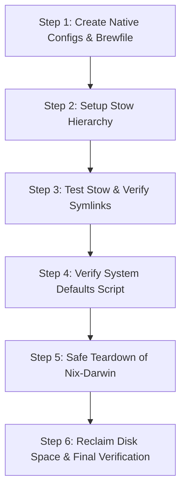

# Migration Plan: From Nix-Darwin to Native macOS (Stow + Brewfile + Mise + Just)

> **Status:** Pending Approval  
> **Target:** Replace `nix-darwin`, `home-manager`, and `flake.nix` with a clean, native macOS architecture using **GNU Stow**, a unified **Brewfile**, **Mise**, native macOS defaults scripts, and a **Justfile** orchestrator.

---

## 1. Executive Summary & Goals

### The Problem
The current dotfiles rely on `nix-darwin` and `home-manager`. While declarative, it imposes an unnatural Linux-like mental model on macOS:
1. **Homebrew Friction:** Uses `cleanup = "zap"`, forcing manual syncing, a custom shell interception wrapper `brew()`, and risk of deleting imperatively installed tools.
2. **Artificial Out-of-Store Symlinks:** `home.nix` uses `mkOutOfStoreSymlink` to escape Nix's read-only store so config files can be edited in place.
3. **Heavyweight Overhead:** Every rebuild requires Flake evaluation, `sudo darwin-rebuild`, and gigabytes of `/nix/store` garbage collection.

### The Target Architecture
- **Symlink Management:** [GNU Stow](https://www.gnu.org/software/stow/) organises configurations by package, linking them directly into `$HOME`. In-place edits are immediately visible in `git status`.
- **Package Management:** Native [Brewfile](https://github.com/Homebrew/homebrew-bundle) managing CLI formulae, GUI casks, fonts, and taps in one place via `brew bundle`.
- **Polyglot Toolchains & Runtimes:** [Mise](https://mise.jdx.dev/) managing Node, Python, Go, Rust, Java, and CLI dev tools.
- **macOS System Defaults:** Idempotent `scripts/macos-defaults.sh` setting Dock, Finder, Keyboard, and global domain preferences natively.
- **System Services & Daemons:** Native `/etc/pam.d/sudo_local` for Touch ID sudo, standard `~/Library/LaunchAgents/` plists for background jobs.
- **Orchestration:** A root `justfile` providing clean commands (`just sync`, `just brew`, `just macos`, `just bootstrap`).

---

## 2. Directory Structure Comparison

### Current Structure (Nix-based)
```
/Users/egand/.dotfiles/
├── flake.nix
├── flake.lock
├── configuration.nix
├── homebrew.nix
├── home.nix
├── bootstrap.sh
├── rebuild.sh
└── home/
    ├── AGENTS.md
    └── .config/...
```

### Proposed Structure (Native)
```
/Users/egand/.dotfiles/
├── justfile                         # Primary entrypoint (just sync, just brew, just macos)
├── Brewfile                         # Unified packages: brews, casks, fonts
├── bootstrap.sh                     # Idempotent 1-click machine setup
│
├── stow/                            # GNU Stow packages (mirrored to $HOME)
│   ├── zsh/
│   │   ├── .zshrc                  # History, keybindings, aliases, awdl function
│   │   └── .zshenv                 # Environment variables and PATH
│   ├── starship/
│   │   └── .config/starship.toml   # Starship prompt configuration
│   ├── git/
│   │   └── .config/git/config      # Git config (delta, rebase, branch settings)
│   ├── ghostty/
│   │   └── .config/ghostty/config  # Ghostty terminal config
│   ├── nvim/
│   │   └── .config/nvim/           # Full Neovim configuration
│   ├── herdr/
│   │   └── .config/herdr/config.toml
│   ├── ai-agents/
│   │   ├── AGENTS.md               # Canonical cross-agent instructions
│   │   ├── .claude/
│   │   │   ├── settings.json       # Claude Code settings
│   │   │   └── CLAUDE.md -> ../AGENTS.md   # Relative symlink inside package
│   │   ├── .codex/
│   │   │   └── AGENTS.md -> ../AGENTS.md
│   │   ├── .config/
│   │   │   └── opencode/
│   │   │       └── AGENTS.md -> ../../AGENTS.md
│   │   ├── .gemini/
│   │   │   ├── antigravity-cli/    # Settings & dynamic statusline
│   │   │   └── config/
│   │   │       ├── AGENTS.md -> ../../AGENTS.md
│   │   │       └── skills/         # Shared procedural skills
│   │   └── .pi/
│   │       └── agent/              # Themes, models, extensions, settings
│   ├── mise/
│   │   └── .config/mise/config.toml # Global runtime versions & trusted paths
│   └── launchd/
│       └── Library/LaunchAgents/   # User launchd agents (.plist files)
│           ├── daily-system-upgrade.plist
│           ├── opensuperwhisper.plist
│           └── agent-telegram-bridge.plist
│
├── scripts/
│   ├── macos-defaults.sh           # Native macOS preferences (Dock, Finder, UI)
│   ├── setup-touchid.sh            # Enables Touch ID for sudo (/etc/pam.d/sudo_local)
│   ├── setup-folders.sh            # Developer workspace directories
│   ├── setup-keyboard.sh           # US-IT keyboard layout installer
│   └── smart-paste.swift           # Swift helper binary
│
├── keyboard/
│   └── US-IT.bundle
└── raycast/
    └── raycast.rayconfig
```

---

## 3. Detailed Component Migration

### A. Homebrew (`Brewfile`)
Consolidate packages from `homebrew.nix` and CLI utilities currently in `home.nix` (which do not need Mise):
- **Core CLI Tools:** `ripgrep`, `fd`, `fzf`, `jq`, `yq`, `lazygit`, `neovim`, `zoxide`, `eza`, `bat`, `git-delta`, `btop`, `dust`, `duf`, `difftastic`, `just`, `tokei`, `stow`, `gh`, `uv`, `ffmpeg`, `tlrc`, `shellcheck`, `cloudflared`.
- **Local AI Tools:** `ollama`, `mlx-lm`, `llmfit`, `pi-coding-agent`.
- **Nerd Fonts:** `font-blex-mono-nerd-font`, `font-jetbrains-mono-nerd-font`, `font-hack-nerd-font`.
- **GUI Casks:** All 26 existing casks (Ghostty, VS Code, Godot, Blender, Unity Hub, OrbStack, Zen, Raycast, Discord, Telegram, etc.).
- **No Zap / No Interceptor:** Remove the `brew()` shell interception wrapper and `scripts/brew-sync.sh`. Homebrew operates natively without deleting unlisted packages.

### B. Language Runtimes & LSPs (`mise`)
Move language versions and language servers from Nixpkgs to `mise`:
- Go, Node, Python, OpenJDK 21, dotnet, gradle.
- LSPs installed via Mise or standard package managers (ruff, basedpyright, gopls, stylua, lua-language-server, shfmt).

### C. Zsh & Shell Configuration (`stow/zsh`)
Extract the inline shell scripts from `home.nix` into clean files:
- `.zshrc`: History settings (100,000 commands), `bindkey '^f' autosuggest-accept`, aliases (`ls=eza`, `cat=bat`, `g=git`, `ag=antigravity`), and the gaming mode `awdl {on|off|status|toggle}` function with completion.
- Integrate `starship`, `zoxide`, and `fzf` via standard `eval` hooks in `.zshrc`.

### D. macOS System Preferences (`scripts/macos-defaults.sh`)
Translate all `system.defaults` from `configuration.nix` to native `defaults write`:
- **Global:** Dark Mode, KeyRepeat (2), InitialKeyRepeat (20), ApplePressAndHoldEnabled (false), MenuBar auto-hide, disable smart quotes/dashes/capitalization/spelling correction.
- **Dock:** Autohide with zero delay, no recents, no mru-spaces.
- **Finder:** List view by default (`Nlsv`), show hidden files, show pathbar & statusbar, sort folders first, search current folder, disable desktop icons.
- **Trackpad & Screen Capture:** Tap to click, screenshots to `~/Downloads` without window shadows.
- **Power Management:** Apply `pmset` display sleep and disk sleep settings.

### E. Security & Launchd Daemons
- **Touch ID for Sudo:** Create `/etc/pam.d/sudo_local` with `auth sufficient pam_tid.so` (macOS native mechanism, preserved across macOS updates).
- **Launchd Agents:**
  - `disable-awdl`: System daemon or login script to bring `awdl0` down for low-latency Wi-Fi gaming.
  - `daily-system-upgrade.plist`: Runs `just upgrade` daily at 03:00 AM.
  - `opensuperwhisper.plist`: Launches OpenSuperWhisper on graphical login.
  - `agent-telegram-bridge.plist`: Background ChatOps daemon with keepalive.

### F. AI Agent Instructions & Cross-Agent Links
In the previous Nix setup, `home.nix` declared 4 separate out-of-store symlinks pointing to `AGENTS.md`. With Stow:
- The canonical file lives at `stow/ai-agents/AGENTS.md`.
- Inside `stow/ai-agents/`, relative symlinks are committed:
  - `stow/ai-agents/.claude/CLAUDE.md` points to `../AGENTS.md`
  - `stow/ai-agents/.codex/AGENTS.md` points to `../AGENTS.md`
  - `stow/ai-agents/.config/opencode/AGENTS.md` points to `../../AGENTS.md`
  - `stow/ai-agents/.gemini/config/AGENTS.md` points to `../../AGENTS.md`
- When `stow -t $HOME ai-agents` runs, Stow mirrors this exact tree into `$HOME`. Any AI tool opening its local instructions automatically reads the single canonical `AGENTS.md`.

### G. Justfile Orchestration
```just
# Default task: sync dotfiles
default: sync

# Mirror configs to $HOME via GNU Stow
sync:
    mkdir -p ~/.config
    stow -d stow -t {{env_var('HOME')}} --restow */

# Unlink a specific stow package
unlink package:
    stow -d stow -t {{env_var('HOME')}} -D {{package}}

# Install/update packages via Homebrew Bundle
brew:
    brew bundle --file=Brewfile

# Apply macOS system preferences
macos:
    bash scripts/macos-defaults.sh

# Run daily upgrade (Homebrew + Mise + Dotfiles)
upgrade:
    brew update && brew upgrade
    mise upgrade
    just sync

# Full bootstrap on a fresh machine
bootstrap:
    bash bootstrap.sh
```

---

## 4. Phased Implementation & Verification Steps



### Phase 1: Parallel Preparation (Non-Destructive)
1. Generate `Brewfile` containing all existing casks, formulae, and Nerd Fonts.
2. Install `stow` via Homebrew (`brew install stow`).
3. Create `stow/` hierarchy for `zsh`, `starship`, `git`, `ghostty`, `nvim`, `herdr`, `ai-agents`, `mise`, and `launchd`.
4. Create `scripts/macos-defaults.sh` and `scripts/setup-touchid.sh`.
5. Create `justfile`.

### Phase 2: Switch Symlinks to Stow
1. Backup existing active symlinks in `$HOME`.
2. Apply `stow` packages to `$HOME`.
3. Verify that editing files like `~/.config/ghostty/config` reflects immediately in `git status` inside `~/.dotfiles`.

### Phase 3: Nix-Darwin Teardown & Cleanup
1. Remove `nix-darwin` system activation and launch daemons (`/run/current-system`).
2. Restore `/etc/pam.d/sudo` or ensure `/etc/pam.d/sudo_local` is active.
3. Remove Nix hook from shell startup files (`/etc/zshrc`, `/etc/profile`).
4. (Optional user choice): Run Determinate Nix uninstaller (`/nix/nix-installer uninstall`) to reclaim 10-30+ GB of disk space.
5. Delete legacy Nix files: `flake.nix`, `flake.lock`, `configuration.nix`, `home.nix`, `homebrew.nix`, `rebuild.sh`.

---

## 5. Reviewer Questions & Decisions

> [!NOTE]
> ### Decided: Clean Target for macOS Reset (No In-Place Teardown Needed)
> The user will perform a full macOS reset once the dotfiles are finalized. No in-place uninstallation of Determinate Nix or manual `/nix` volume deletion is needed on the current system. The primary goal is ensuring the new repository is **100% self-contained, reproducible, and tested for a clean 1-click bootstrap on a fresh macOS installation**.

> [!NOTE]
> ### Decided: Subagent Execution Strategy
> Selected: **Phased Subagents with Main Agent Review**. One subagent will prepare the `stow/` tree and `Brewfile`, another will write `macos-defaults.sh` and `justfile`, and the main agent will orchestrate, test symlinks, verify shell readiness, and manage the clean Nix transition.
